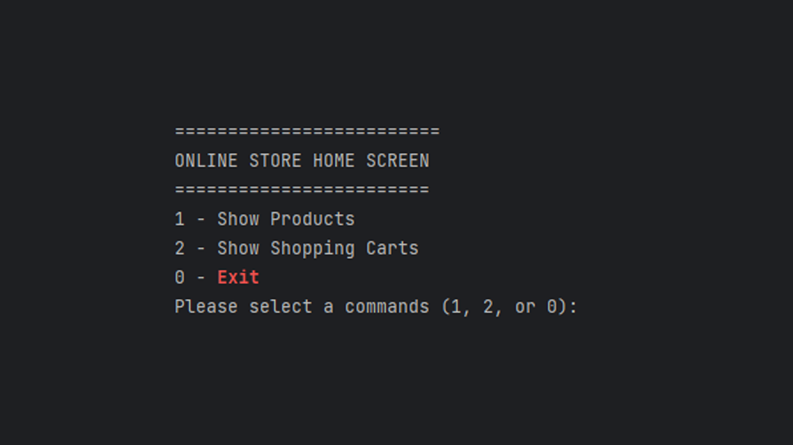
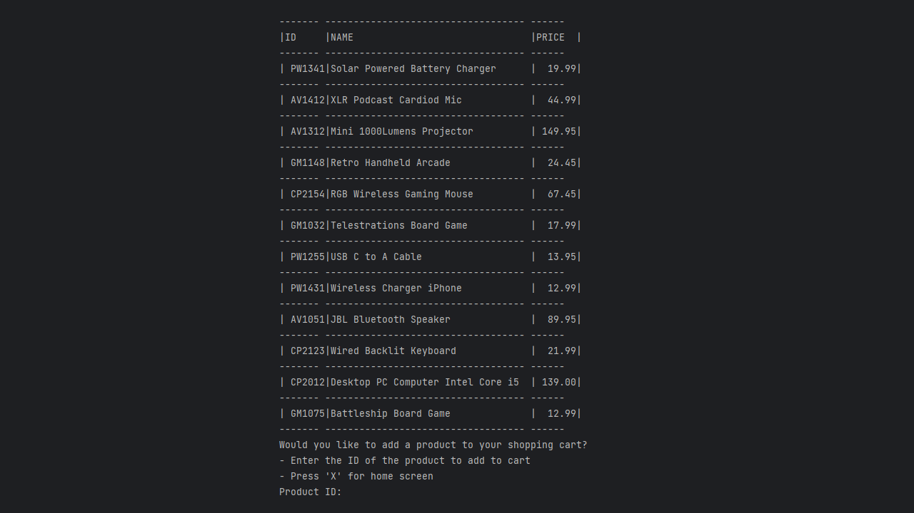
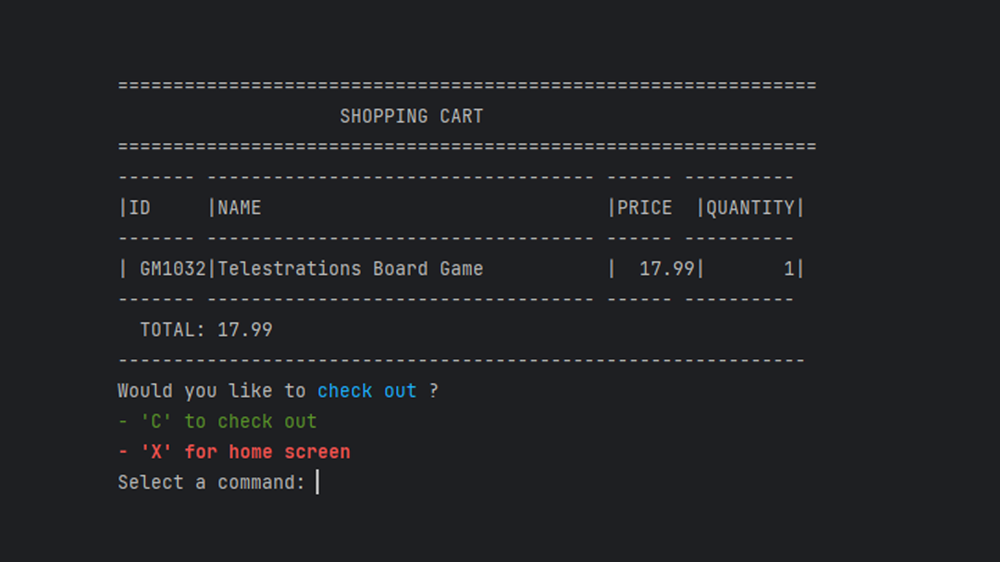
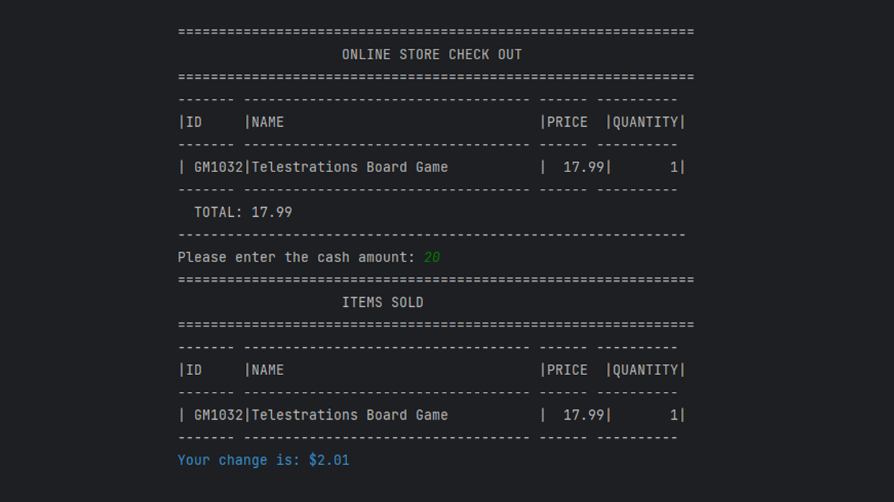
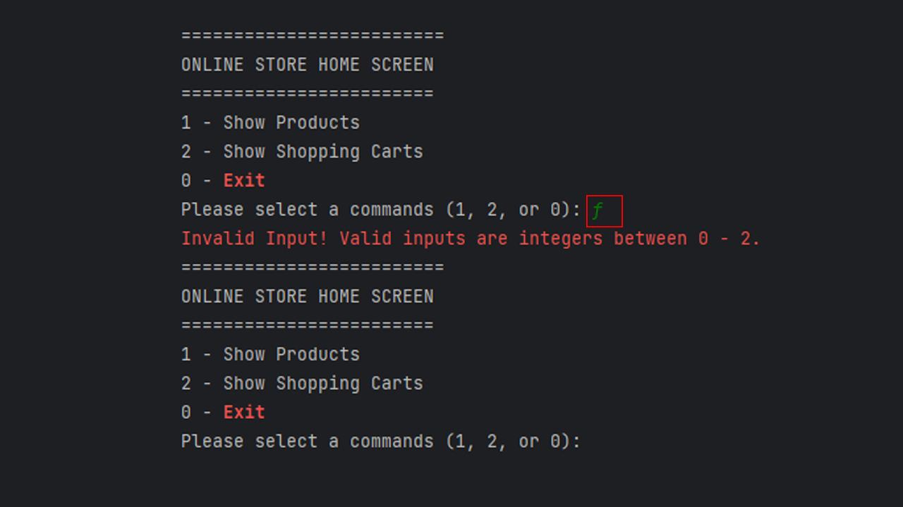
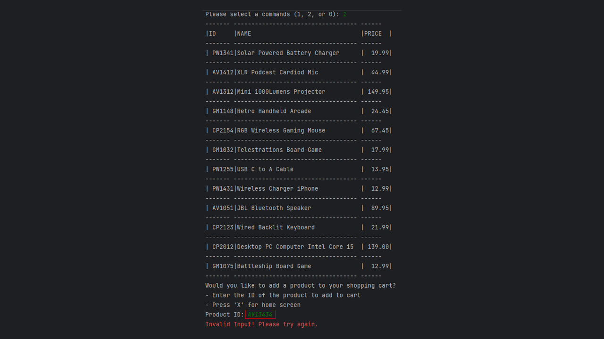
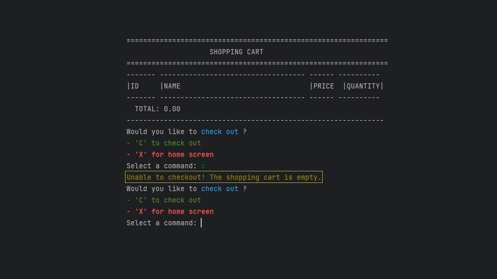

# Table of Contents

1.  [Introduction](#introduction)
    -   Project Description
2.  [Interesting code](#interesting-code)
3.  [CLI Screens](#cli)
    -   Home Screen
    -   All Proucts Screen
    -  Shopping-cart Screen
    -   Checkout Screen
    -   Error Screens
4.  [How To Use](#howtouse)
    -   Home Screen
    -   All Product Screen
    -  Shopping-cart Screen
    -  Checkout Screen
    - Exiting
 # Introduction <a name="introduction"></a>
 ## Project Description <a name="project-description"></a>
### Online Store 🏪

This console application allows users to add products to shopping cart and check out. 
Users have the ability to:
1. List all products 🛍️
2. Add product to shopping cart✅
3. List products in the shopping cart 🛒
4. Check out the shopping cart 🏧
# Interesting Code <a name="interesting-code"></a>&nbsp;

The code demonstrates how to use a do-while loop to receive user input and validate it using a switch statement in Java. What makes this code interesting is the use of a try and catch clause to catch exceptions when the user enters input that is not an integer. In such cases, the code displays an error message and recursively calls the home screen function. This approach ensures that the program does not crash due to invalid input from the user. You can use this code as a reference when developing a Java program that requires user input validation.
```java
 do
 {
 try // try-catch clause in case the user inputs a string  
 {  
option = scanner.nextInt();  
 switch (option) // switch cases to validate user input  
  {  
	 case 0 -> System.exit(1);  
	 case 1 -> {isValidOption = true;displayProduct();}  
	 case 2 -> {scanner.nextLine(); isValidOption = true;displayShoppingCart();}
	 default -> {System.out.println(ConsoleColor.RED + "The command selected is invalid!"
				+ ConsoleColor.RESET); // error message  
				isValidOption = false; 
}  
}  
}  
catch (InputMismatchException ex)  
{System.out.println(ConsoleColor.RED + "Invalid Input! Valid inputs are integers between 0 - 2."  
  + ConsoleColor.RESET); // error message  
  homeScreen();  
}  
}  
while (!isValidOption);
```

# CLI Screens 💻 <a name="cli"></a>

### Home Screen <a name="hs"></a>



### List All Products <a name="allPS"></a>



### Shopping Cart Screen <a name="sCS"></a>



### Checkout Screen <a name="cOS"></a>



### Error Messages <a name="eS"></a>





### Warning Message



# How To Use 📘<a name="howtouse"></a>

## Home Screen <a name="homeScreen"></a>
The home screen of this application presents the user with three main options. Pressing 1 allows the user to view all the products available in the online store and add them to their shopping cart. Pressing 2 lets the user view the contents of their shopping cart and proceed to the checkout screen. Pressing 0 allows the user to exit the application. This design makes it easy for the user to navigate the application and perform the desired actions with ease.
## All Products Screen <a name="allProductScreen"></a>
This screen displays all the available products that the user can add to their shopping cart. To add a product to the cart, the user can input the product's ID. This feature ensures that the user can quickly and easily add the desired products to their cart without having to navigate through several pages. You can use this code as a reference when developing a similar online store program that requires users to add products to their shopping cart.
## Shopping Cart Screen <a name="shopping-CartScreen"></a>
The shopping cart screen displays all the products that the user has added to their cart. This screen shows the total amount that the user owes and the quantity of each item in the cart. It provides the user with a clear overview of their current shopping status and enables them to proceed to checkout with ease. You can use this application as a reference when developing a similar online store program that requires users to view and manage the contents of their shopping cart.
##  Checked Out Screen <a name="checkoutScreen"></a>
The checkout screen allows the user to pay for their products by entering the cash amount. If the cash amount is insufficient to cover the total cost, a warning message is displayed and the user is returned to the home screen. However, if the user has sufficient funds, the screen displays the amount of change owed to the user. This feature ensures that the checkout process is smooth and efficient
## Exiting <a name="exiting"></a>
The user can exit the application from the home screen by pressing 0 and then enter.
